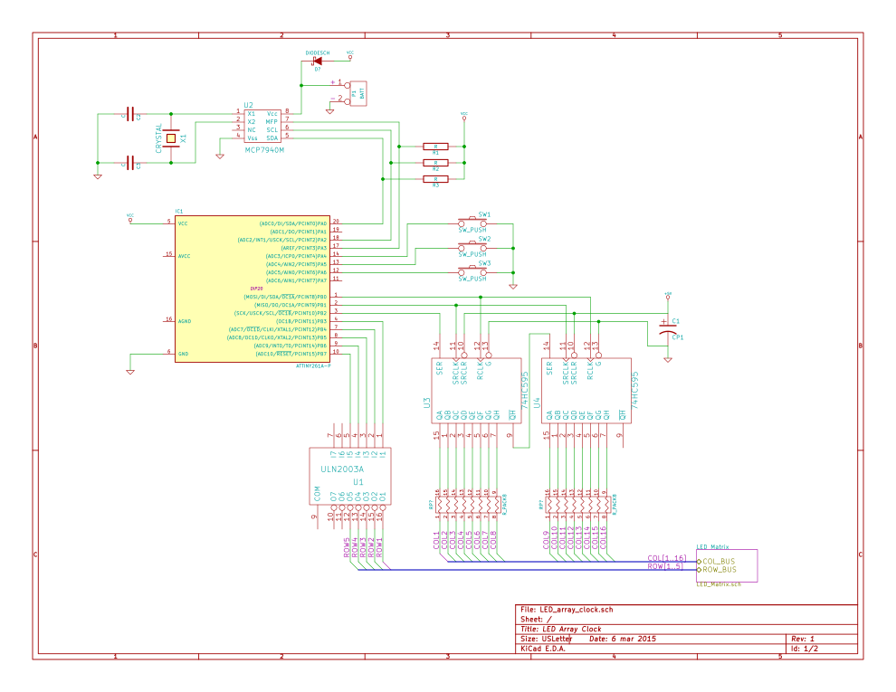
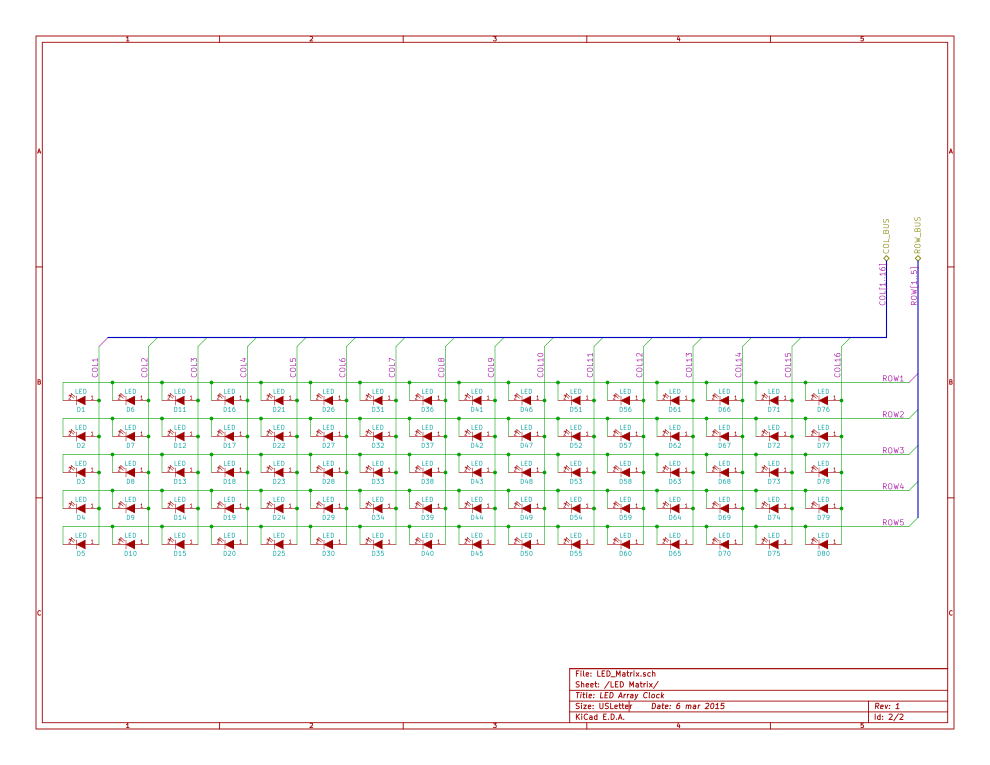

## LED Matrix Clock

A simple clock with 16x5 LED Matrix display using SIPO shift registers to allow individual addressing of 80 LED's via 8 digital GPIO's. Timing provided via RTC with XTAL.

## Why?

This is noting revolutionary, and it's certainly been done a million times before, but never by me. This is essentially
a learning experience for me. I've decided on a 16x5 matrix size as it will be convenient to adopt into a digital clock
using a 3x5 digits, plus ":" and spaces.

## What's in the repo?

I'm starting this from the board up. I'll begin with the schematics, and subsequent PCB design (using kicad).
I'll follow this up with the software to drive the matrix. Prototyping will be done on an Arduino, with the 
intent to port over to an AVR, or possibly PIC MCU for the "production" version.
